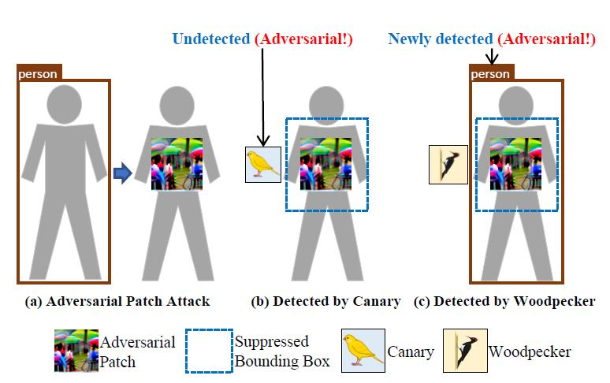

# Code for "Fight Fire with Fire: Combating Adversarial Patch Attacks using Pattern-randomized Defensive Patches" in IEEE S&P 2025

Code for "Fight Fire with Fire: Combating Adversarial Patch Attacks using Pattern-randomized Defensive Patches" in IEEE S&P 2025



## Requirements

The code is tested with PyTorch 1.12.1. The complete list of required packages are available in `requirements.txt`, and can be installed with `pip install -r requirements.txt`. The code should be compatible with other versions of packages.

## Datasets

The links of datasets can be found in /datasets/README.md.

## Usage
Download files and weights of object detectors from https://drive.google.com/file/d/1bjiYFo9wWhSKID_eXZlfMvgQRKDShMD2/view?usp=sharing and put them in ./ObjectDetector/


#### Faster R-CNN

##### Train

```python
python FSRCNN_Combiner.py --train --df_mode C --defensive_patch_location cc --canary_cls_id 24 --canary_size 120 --person_conf 0.075 --weight 2.0

python FSRCNN_Combiner.py --train --df_mode W --defensive_patch_location cc --wd_size 120 --person_conf 0.075 --weight 1.0
```

##### Test

```python
python FSRCNN_Combiner.py --test --df_mode C --defensive_patch_location cc --canary_cls_id 24 --canary_size 120 --person_conf 0.075 --best_canary_path ./trained_dfpatches/FSRCNN/canary.png --input_img XXX

python FSRCNN_Combiner.py --test --df_mode W --defensive_patch_location cc --wd_size 120 --person_conf 0.075 --best_wd_path ./trained_dfpatches/FSRCNN/wd.png --input_img XXX

python FSRCNN_Combiner.py --test --df_mode A --defensive_patch_location cc --canary_cls_id 24 --canary_size 120 --wd_size 120 --person_conf 0.075 --best_canary_path ./trained_dfpatches/FSRCNN/canary.png --best_wd_path ./trained_dfpatches/FSRCNN/wd.png --input_img XXX

```


#### YOLOv2

##### Train

```python
python YOLOv2_Combiner.py --train --df_mode C --defensive_patch_location cc --canary_cls_id 22 --ca_size 60 --person_conf 0.05 --weight 2.0

python YOLOv2_Combiner.py --train --df_mode W --defensive_patch_location cc --wd_size 60 --person_conf 0.05 --weight 1.0
```

##### Test

```python
python YOLOv2_Combiner.py --test --df_mode C --defensive_patch_location cc --canary_cls_id 22 --ca_size 60 --person_conf 0.05 --best_canary_path ./trained_dfpatches/YOLOv2/canary.png --input_img XXX

python YOLOv2_Combiner.py --test --df_mode W --defensive_patch_location cc --wd_size 60 --person_conf 0.05 --best_wd_path ./trained_dfpatches/YOLOv2/wd.png --input_img XXX

python YOLOv2_Combiner.py --test --df_mode A --defensive_patch_location cc --canary_cls_id 22 --ca_size 60 --wd_size 60 --person_conf 0.05 --best_canary_path ./trained_dfpatches/YOLOv2/canary.png --best_wd_path ./trained_dfpatches/YOLOv2/wd.png --input_img XXX
```


#### YOLOv4

##### Train

```python
python YOLOv4_Combiner.py --train --df_mode C --defensive_patch_location cc --canary_cls_id 22 --canary_size 60 --person_conf 0.05 --weight 2.0

python YOLOv4_Combiner.py --train --df_mode W --defensive_patch_location cc --wd_size 60 --person_conf 0.05 --weight 1.0
```

##### Test

```python
python YOLOv4_Combiner.py --test --df_mode C --defensive_patch_location cc --canary_cls_id 22 --canary_size 60 --person_conf 0.05 --best_canary_path ./trained_dfpatches/YOLOv4/canary.png --input_img XXX

python YOLOv4_Combiner.py --test --df_mode W --defensive_patch_location cc --wd_size 60 --person_conf 0.05 --best_wd_path ./trained_dfpatches/YOLOv4/wd.png --input_img XXX

python YOLOv4_Combiner.py --test --df_mode A --defensive_patch_location cc --canary_cls_id 22 --canary_size 60 --wd_size 60 --person_conf 0.05 --best_canary_path ./trained_dfpatches/YOLOv4/canary.png --best_wd_path ./trained_dfpatches/YOLOv4/wd.png --input_img XXX
```


#### YOLOR

##### Train

```python
python YOLOR_Combiner.py --train --df_mode C --defensive_patch_location cc --canary_cls_id 22 --canary_size 120 --person_conf 0.05 --weight 2.0

python YOLOR_Combiner.py --train --df_mode W --defensive_patch_location cc --wd_size 140 --person_conf 0.05 --weight 1.0
```

##### Test

```python
python YOLOR_Combiner.py --test --df_mode C --defensive_patch_location cc --canary_cls_id 22 --canary_size 120 --person_conf 0.05 --best_canary_path ./trained_dfpatches/YOLOR/canary.png --input_img XXX

python YOLOR_Combiner.py --test --df_mode W --defensive_patch_location cc --wd_size 140 --person_conf 0.05 --best_wd_path ./trained_dfpatches/YOLOR/wd.png --input_img XXX

python YOLOR_Combiner.py --test --df_mode A --defensive_patch_location cc --canary_cls_id 22 --canary_size 120 --wd_size 140 --person_conf 0.05 --best_canary_path ./trained_dfpatches/YOLOR/canary.png --best_wd_path ./trained_dfpatches/YOLOR/wd.png --input_img XXX
```


#### YOLOv8

##### Train

```python
python YOLOv8_Combiner.py --train --df_mode C --defensive_patch_location cc --canary_cls_id 22 --canary_size 80 --person_conf 0.05 --weight 2.0

python YOLOv8_Combiner.py --train --df_mode W --defensive_patch_location cc --wd_size 80 --person_conf 0.05 --weight 1.0
```

##### Test

```python
python YOLOv8_Combiner.py --test --df_mode C --defensive_patch_location cc --canary_cls_id 22 --canary_size 80 --person_conf 0.05 --best_canary_path ./trained_dfpatches/YOLOv8/canary.png --input_img XXX

python YOLOv8_Combiner.py --test --df_mode W --defensive_patch_location cc --wd_size 80 --person_conf 0.05 --best_wd_path ./trained_dfpatches/YOLOv8/wd.png --input_img XXX

python YOLOv8_Combiner.py --test --df_mode A --defensive_patch_location cc --canary_cls_id 22 --canary_size 80 --wd_size 80 --person_conf 0.05 --best_canary_path ./trained_dfpatches/YOLOv8/canary.png --best_wd_path ./trained_dfpatches/YOLOv8/wd.png --input_img XXX
```


If anything is unclear, please open an issue or contact Jianan Feng ([jiananfeng@ruc.edu.cn](mailto:jiananfeng@ruc.edu.cn)).

## Citations

If you find our work useful in your research, please consider citing:

```
@inproceedings{defensepatches2025sp,
	author = {Jianan Feng, Jiachun Li, Changqing Miao, Jianjun Huang, Wei You, Wenchang Shi and Bin Liang},
	title = {Fight Fire with Fire: Combating Adversarial Patch Attacks using Pattern-randomized Defensive Patches},
	booktitle = {2025 IEEE Symposium on Security and Privacy },
	publisher = {IEEE},
	year = {2025}
}
```


