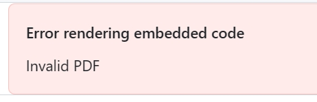
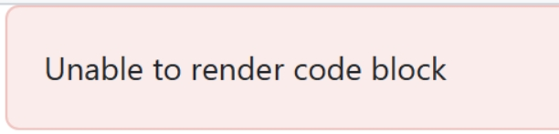
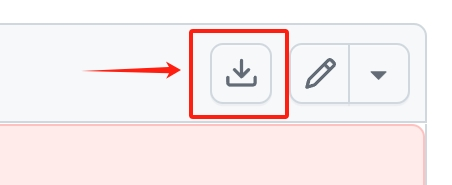

This folder includes the data for the SP25 rebuttal. The file or folder names are corresponding to the question indices. For example,  is corresponding to the Q1 of Review A. 

Note that, *the PDF files may not directly displayed in browsers*. Errors may occur as shown in Fig. 1 or Fig. 2. Please **refresh the page**. If the file still cannot be displayed, please **download it** by clicking the button in Fig. 3.

Fig. 1: Invalid PDF error

Fig. 2: PDF rendering error

Fig. 3: Downloading button

